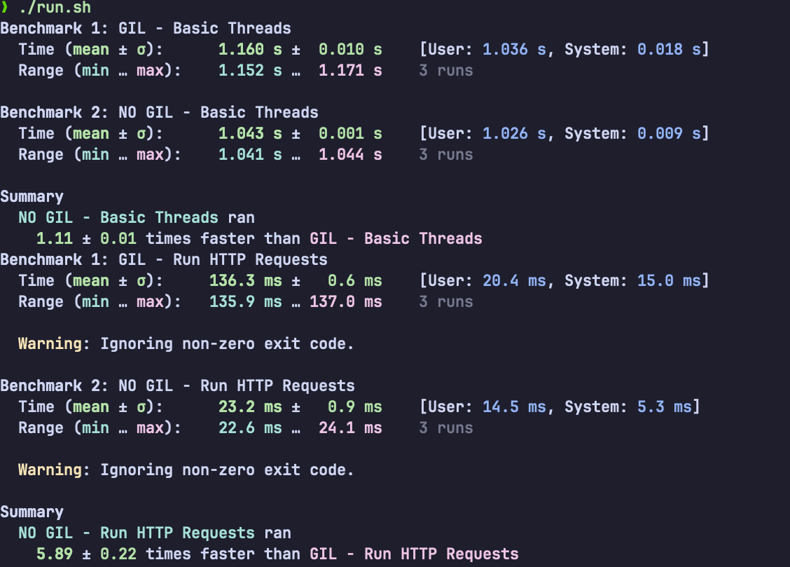

# Python Gil vs No Gil Comparisons

Reference: [here](https://ataiva.com/python-3-13-no-gil-multi-threading-performance/)

----

## Installation:

```
# Clone the Python source code
git clone https://github.com/python/cpython.git
cd cpython

# Check out the 3.13 branch (or the latest release branch)
git checkout 3.13

# Configure and build with no-GIL support
./configure --without-gil --prefix=/opt/python3.13-nogil
make -j4
make install

```

---

## Run the tests

```
chmod +x run.sh
./run.sh

```

---

## Benchmark results


